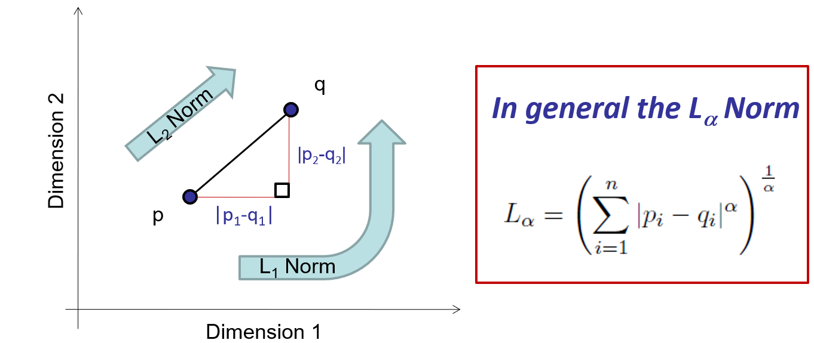
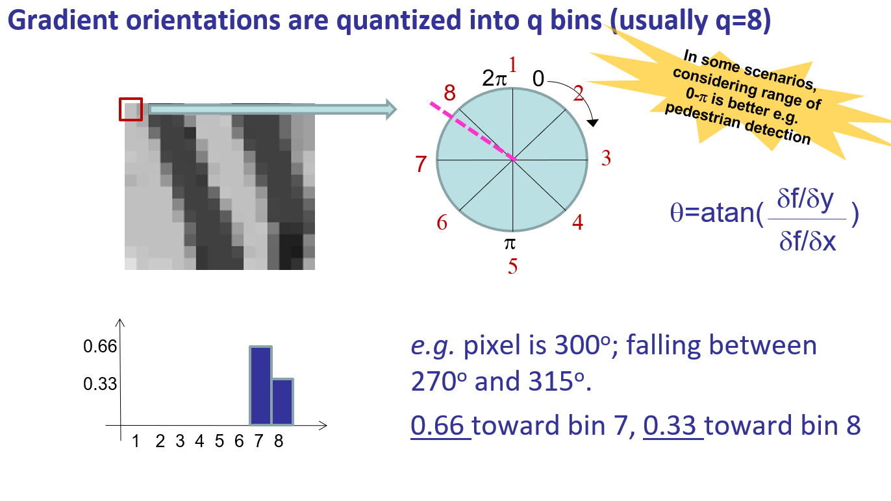
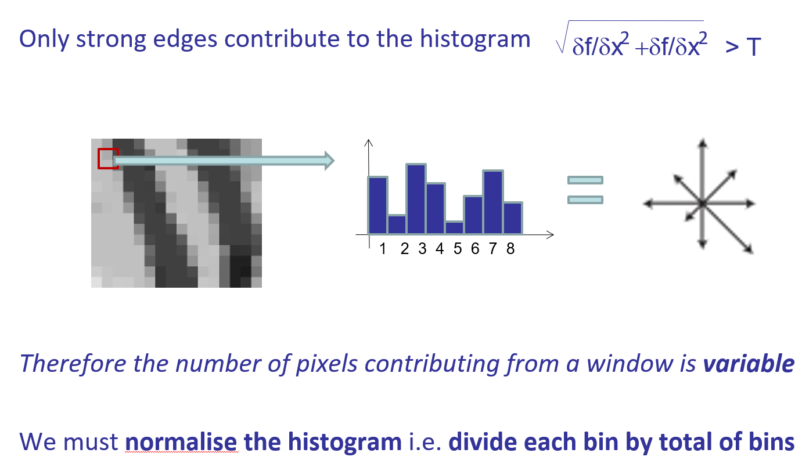
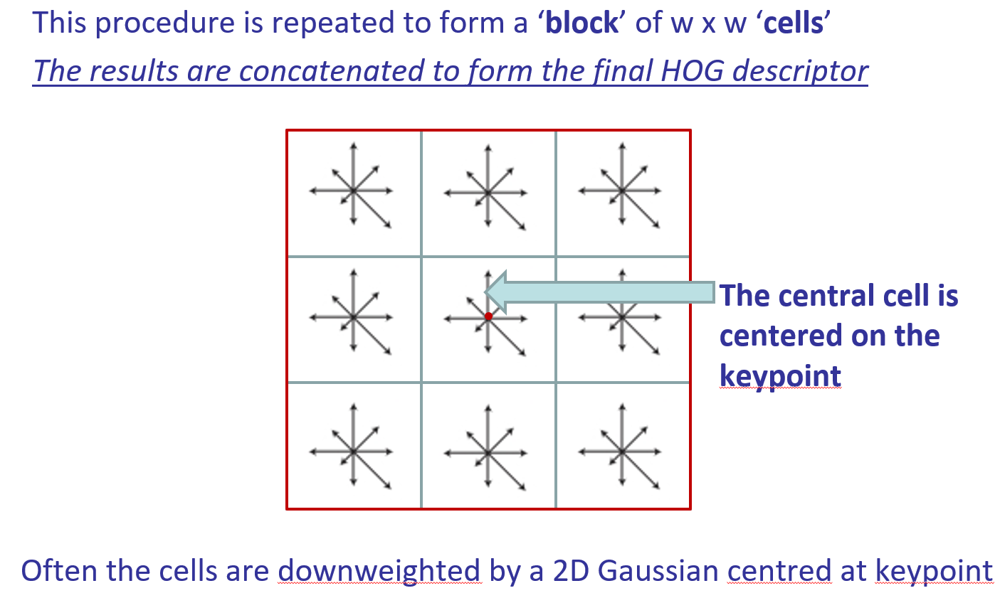

## Harris Corner Detector
Intuition: if we move a small observing window,
* In the flat region, there will be no change in all directions
* In the edge, the motion along the edge cannot be identified
* In the corner, the pattern inside will change in all direction

The difference can be described by auto-correlation of the patch

$\sum_w [I(x+u,y+v)- I(x,y)]^2$

take the first order Taylor expansion of $I(x+u,y+v)$, then arrange the formula into matrix form

$\sum_w [I(x,y) + uI_x +vI_y- I(x,y)]^2$

$= \begin{bmatrix}
u & v
\end{bmatrix} \cdot
\Big(\sum_w
\begin{bmatrix}
I^2_x & I_xI_y \\
I_xI_y & I^2_y
\end{bmatrix}\Big) \cdot
\begin{bmatrix}
u  \\
v
\end{bmatrix} 
$

denotes the covariance matrix as $M$, which is also called Harris matrix, also mathematically called structure tensor  

Efficient computation:  Det (M)  >> Trace (M)
R-score =  Det(M) – k$\cdot$Trace(M)$^2$  = $\lambda_1\lambda_2 - k (\lambda_1+\lambda_2)^2$
[Harris recommends k=0.04]
* Big R indicates corner
* Negative R indicates edge
* Small R indicates flat region

* Rotation Independent
* Scale Dependent

## Keypoint Descriptor
A good descriptor is compact and discriminative
Distances: Euclidean Distance; city-block (Manhattan) distance

## Histogram of Oriented Gradients
Only strong edges contribute to the histogram, Therefore the number of pixels contributing from a window is variable, We must normalise the histogram i.e. divide each bin by total of bins

## HOG Pedestrian detection 
* HOG is densely sampled within a “detection window” of 64x128 pixels – HOG windows overlap by half a windows length
* The HOG descriptors within the window are concatenated and normalised again.
* A practical final step is to group detection windows that fire as positive into groups of overlapping detection windows. Pick the strongest detection window in each group as the result

The best support vector (SV) is one that maximises the margin between categories

Take dot product of test point with vector a perpendicular to support vector
The sign of the dot product determines its class
Multi-class SVC

## Scale Invariant Feature Transform (SIFT)
* SIFT is robust, i.e. affine invariant (rotation and scale invariant)
    * Robust to 60 degrees viewpoint change
    * Robust to 2x scale change
    * Partial robust to illumination change
* SIFT can be used as both detector and desciptor 

SIFT descriptor:
1. Divide the 16x16 (pixel) window into a 4x4 grid 
2. Compute the orientation histogram (8 oritentation bins) in each grid cell
3. Concatentate histograms to form descriptor ($4 \times 4 \times 8 = 128$ dimensions) 

The SIFT descriptor is often more robust than HOG.
The SIFT descriptor is simply a HOG of n=4, w=4, q=8 cut from a window centered at (x,y), but the window is first scaled down proportionate to $\sigma$

### SIFT Process
1. Scale-space Extrema Detection
SIFT algorithm uses Difference of Gaussians which is an approximation of LoG. Difference of Gaussian is obtained as the difference of Gaussian blurring of an image with two different $\sigma$, let it be $\sigma$ and $k\sigma$. This process is done for different octaves of the image in Gaussian Pyramid.
$k=2^\frac{1}{s}$
为了在每组中检测S个尺度的极值点，DOG金字塔每组需S+2层图像，因为DOG金字塔的每一层和其上下两层比较得到极值点，第一层和最后一层是不能检测极值点的，而DOG金字塔由高斯金字塔相邻两层相减得到，则高斯金字塔每组需S+3层图像。
在检测极值点前对原始图像高斯平滑会丢失高频信息，所以 在建立尺度空间前首先对原始图像长宽扩展一倍，以保留原始图像信息，增加特征点数量。

Gaussian滤波器，压制高频信息，而DOG算子在Gaussian滤波器压制高频的基础上，又压制了低频的区域，形成一个带通滤波器。带通，指指定频带通过，在空域上，表现为指定尺度的细节图像保留下来。

Once this DoG are found, images are searched for local extrema over scale and space. One pixel in an image is compared with its 8 neighbours as well as 9 pixels in next scale and 9 pixels in previous scales. If it is a local extrema, it is a potential keypoint.

2. Keypoint Localization
* Remove low-contrast keypoints 
Taylor series expansion of scale space to get more accurate location of extrema, and if the intensity at this extrema is less than a threshold value (0.03 as per the paper), it is rejected.

* Remove edge keypoints
DoG has higher response for edges. A 2x2 Hessian matrix (H) to compute the principal curvature. Its two eigenvalue are proportional to principal curvatures. If the ratio is greater than a threshold, that keypoint is discarded. 
$ H = \begin{bmatrix}
I_{xx} & I_{xy} \\
I_{yx} & I_{yy} \\
\end{bmatrix}$

3. Orientation Assignment
An orientation is assigned to each keypoint to achieve invariance to image rotation. An orientation histogram with 36 bins covering 360 degrees is created
Histogram entries are weighted by (i) gradient magnitude and (ii) a Gaussian function with $\sigma$ equal to 1.5 times the scale of the keypoint. The radius of the circle is $3\sigma$

The highest peak in the histogram is taken and any peak above 80% of it is also considered to calculate the orientation.(About 15% of keypoints has multiple orientations assigned.Significantly improves stability of matching.)

4. Keypoint Descriptor
In order to achieve orientation invariance, the coordinates of the descriptor and the gradient orientations are rotated relative to the keypoint orientation.

16x16 window -> 4x4x8 = 128 dimensional feature

5. Keypoint Matching
* SIFT descriptors are points in a 128-dimensional space
* Pair off descriptors, closest first 
* Match in the other direction
    * Any points that don’t map directly back –> discard
    * If the second-closest distance is < 1.4 x closest-distance -> discard

### SIFT Properties
* Affine Invariance(linear: rotation ,shear, scaling + translation)
* Robust to viewpoint change (~45 degrees)
* Robust to scale change (around 2x)
* Partial robust to illumination change## Vector Quantization
One way to combine descriptors is to group them into visually similar clusters.
Divide up (quantize) the vector space in which descriptors are embedded.
* Feature space divided into k regions
* Thus each descriptor is mapped to a label {1…k}  we called this a CODEWORD
* The DICTIONARY of codewords is {1..k}
