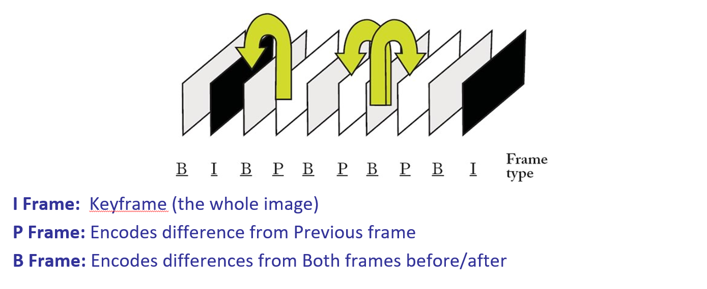
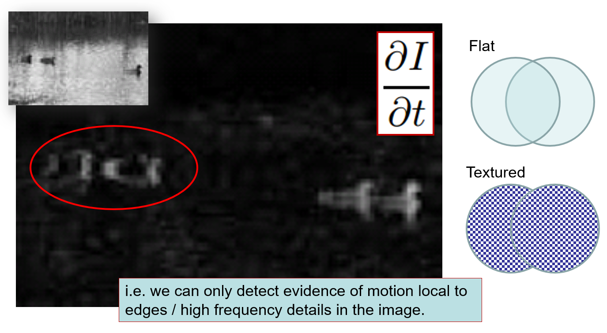

Many video codecs compress video by including only a small number of frames, and encoding differences between them

## Aperture Problem
* An optical illusion when the view is sufficiently local
* Only components of the motion vector perpendicular to the edge direction are detectable

* optical flow is not motion field

* the actual motion is not always observable

## 2D Motion Constraint Equation
### Brightness Constancy Equation
$I(x,y,t)=I(x+dx,y+dy,t+dt)$

1-st order Taylor expansion $\nabla I\cdot v = -I_t$
1 equation, 2 unknowns (2D vector) -> Aperture problem

### Smoothness Assumption
We assume neighbouring pixels will have similar optical flow in the local area 
  
 
Iterative solution:
1. Start with an estimate of u and v of 0 everywhere
2. Then compute the averages $\bar{u}$ and $\bar{v}$
3. Estimate $u$ and $v$ 
4. Iteratively processing until the results at iteration n and n+1 are very similar     