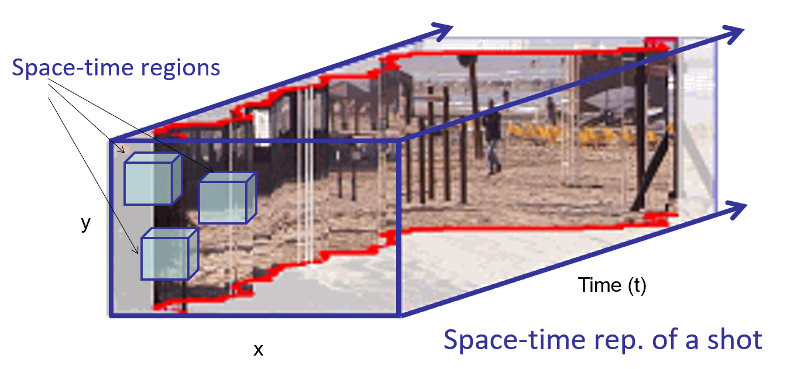
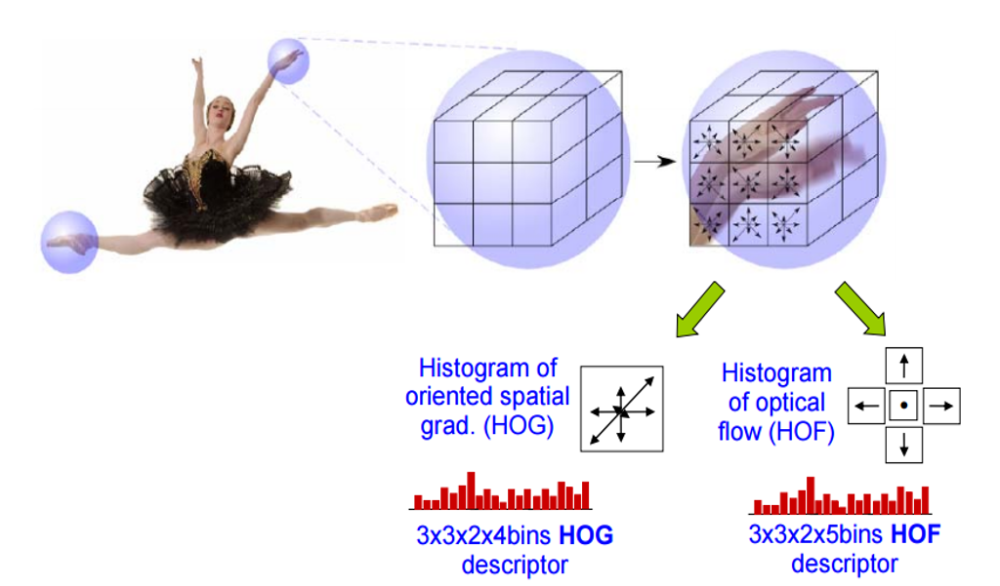
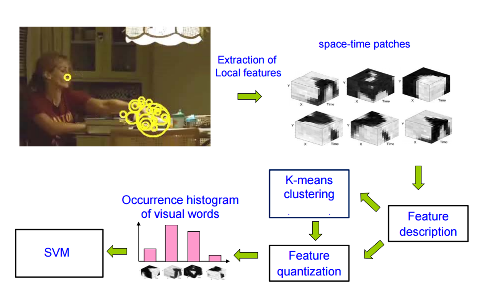
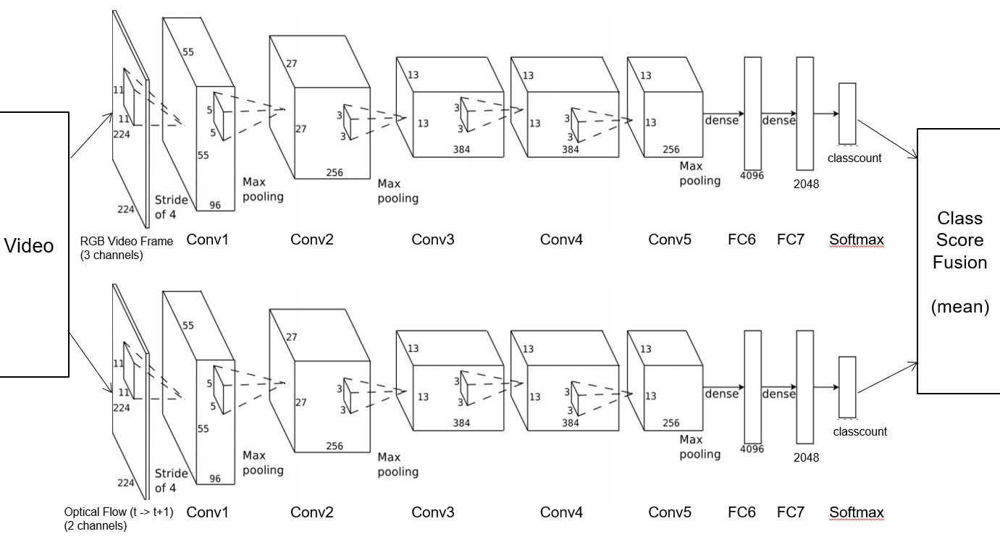

## Shot Detection
* shots delimited by scene changes
* scene changes occur when content changes significantly
* Frequency histogram (pdf) of frame reflects its content
* HSV space commonly used for shot detection (only H and S)
* Shot descriptor can also be clustered e.g. using k-means
Video Structuring

## Activity Recognition
### Motion History Image (MHI)
* Computed from binary masks of object (thresholded) over time

* Advantages:
    * Simple and fast
    * Works in controlled datasets (e.g. Aerobics, KTH)
* Disadvantages:
    * Prone to background subtraction/thresholding errors
    

### Spatial Motion Descriptor
* Based upon optical flow vectors between adjacent frames

### Spatio-temporal Representation
* Often interested in short-time events local to area of frame 
* Convenient to consider video as a 3D volume (x,y,t)

### Space-time Action Recognition
Extension of HOG/SIFT in 2D to (x,y,t)
* Detect keypoints within each frame
* Compute HOG over space-time region local to keypoint
* Compute HOF (ST-HOG over optical flow field) local to keypoint
* Clustering ST-HOG/HOF yields groups of common actions

Application of the VQ(Vector Quantization) (BoVW) pipeline

### Deep Learning for Action Recognition
Two stream network - combining appearance and optical flow 

## Anomaly Detection
Finding actions we don’t expect / can’t define in advance
Anomalies = events not evidenced in the database
Attempt to locate space-time regions in the query video within the set of all space-time regions in the database

## Video Salience
Instead of database lookup – only lookup within query video