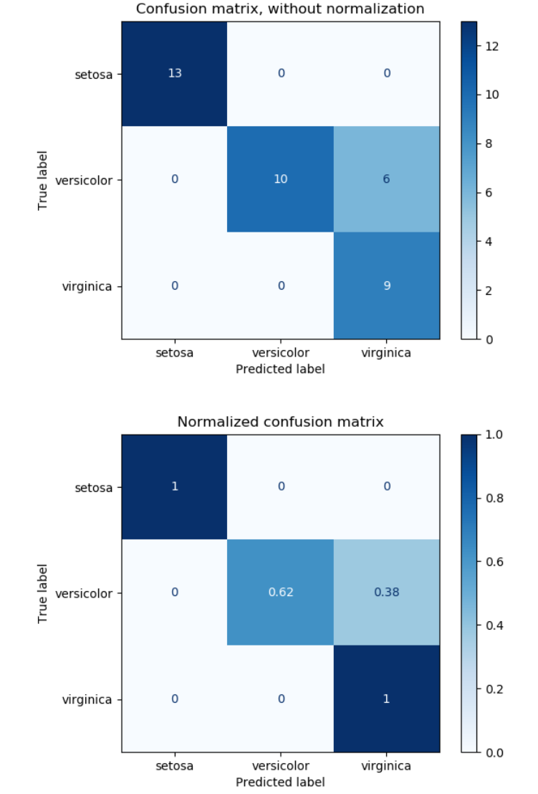
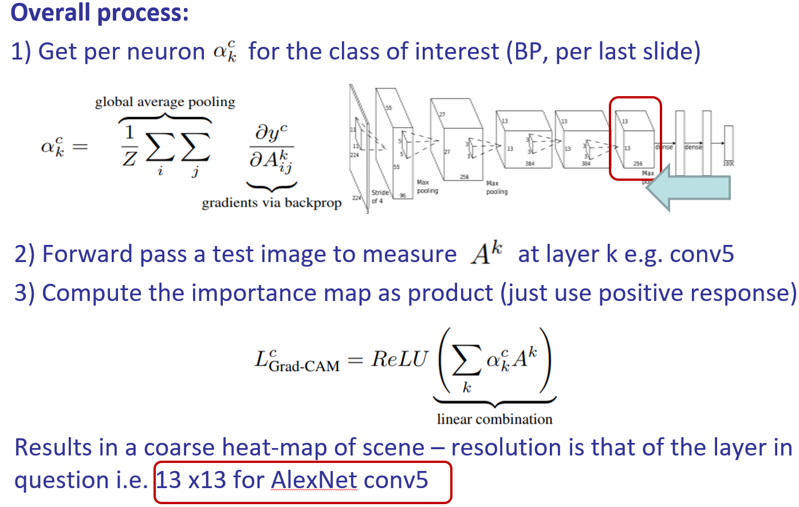
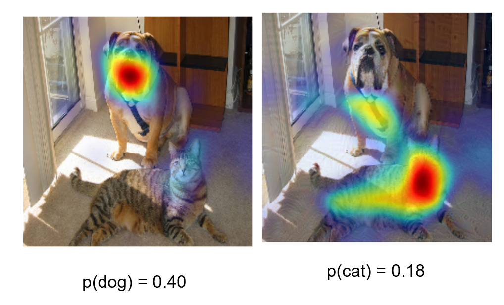
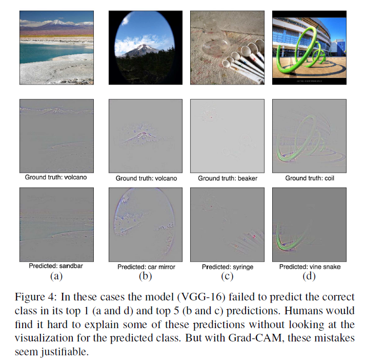
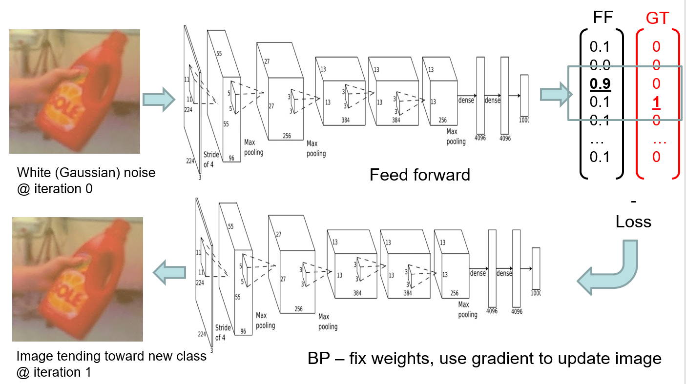
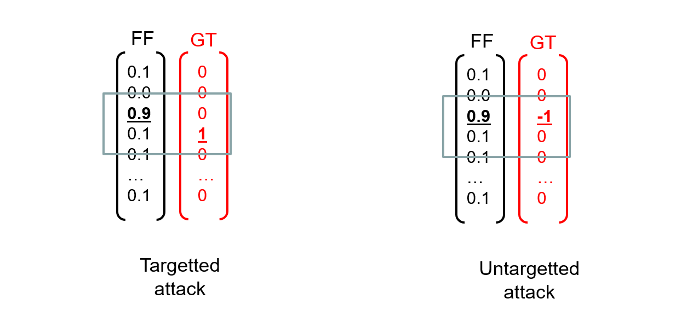
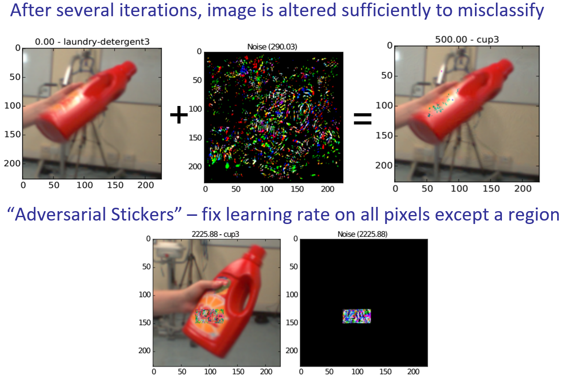

CNN Interpretability
## Evaluation
* Confusion Matrix
The figures show the confusion matrix with and without normalization by class support size (number of elements in each class). This kind of normalization can be interesting in case of class imbalance to have a more visual interpretation of which class is being misclassified.

* Top-K accuracy
Example, “top-5”:  Check the top 5 scoring elements in output vector
If any are the correct (ground truth) class, then test image correctly classified. top-5 error rate = 1- top 5 AP.
## Explain
* Activation Maximisation
    * synthesise an ideal image for a class
    * take your trained network fix the weights and use backprop to iteratively update the values of pixels in the input image
    
    * A simple loss is the MSE between the FF and GT response with regularization.
    * Each pixel is independently influenced during BP: images synthesised in this way are prone to high frequency noise 
    * We choose an regularization that tries to minimise high freq noise – Total Variation (TV) $||\nabla f(u,v)||^2$
    
    * Visualization
    
    
* Grad-CAM (Gradient weighted Class Activation Mapping)
uses the gradients flowing into the last conv layer (i.e. prior to fc layers) to determine which neurons contribute most to prediction
$y_c$ is the logits (output at fc layer prior to softmax) for class c  
$A_k$ is the kth activation map
We apply a ReLU to the linear combination of maps because we are only interested in the features that have a positive influence on the class of interest

* Adversarial Images
    * Iteratively modify pixels to push CNN over decision boundary e.g. for second closest class
    * Fast Gradient Method: Use back-prop to evolve image of one class toward class of another
    
    
    
