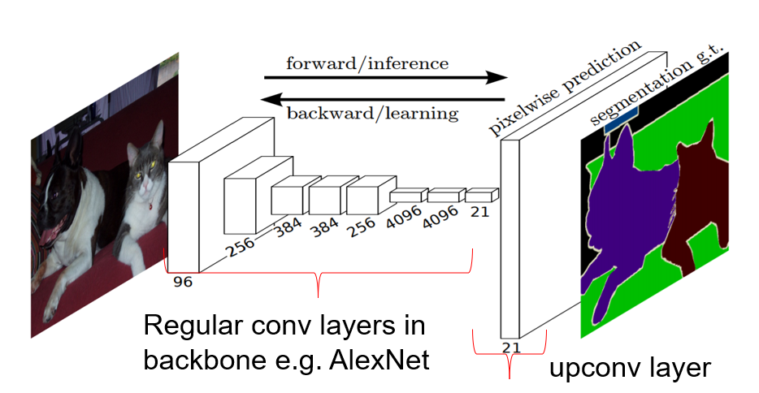

All Convolutional Network: 
Dimensionality reduction is performed via strided convolution rather than max-pooling
## FCNs for Semantic Segmentation
Fully Convolutional Networks
FCN:

* Note that no dense layer is used
    * reduce the number of parameters and computation time.
    * the network can work regardless of the original image size, without requiring any fixed number of units at any stage, given that all connections are local.
* Segmentation networks usually have 2 parts
    * Down-sampling path: capture semantic/contextual information
        * Backbone of the FCN (e.g. AlexNet, VGG, GoogLeNet) is pre-trained as a discriminative classfier i.e. softmax loss.
    * Up-sampling path: recover spatial information
        * 采用反卷积层对最后一个卷积层的feature map进行上采样, 使它恢复到输入图像相同的尺寸
        
        * The upconv layer is a ‘backwards’ (or ‘transposed’) convolution
        * https://github.com/vdumoulin/conv_arithmetic
        
    * unpooling
    The max-pooling operation is non-invertible, but we can approximate, by recording the positions where we located the biggest values, then use this positions to reconstruct the data from the layer above
    
    * skip connections: fully recover the fine-grained spatial information lost in the pooling or downsampling layers 
        * transfer local information by concatenating or summing feature maps from the down-sampling path with feature maps from the up-sampling path. 
        * Merging features from various resolution levels helps combining context information with spatial information.
* Regular log-loss can be used on a per pixel basis and summed up.
* Despite data usually being unbalanced (e.g. a lot of BG pixels) usually no rebalancing is necessary and no data augmentation needed.
* Per class accuracy (AP) given via Jaccard (IoU) distance averaged over all images $J(A,B)=\frac{|A\land B|}{A\lor B}$

Video Upsampling via Conv-AEs

Convert a Alexnet into FCN

https://leonardoaraujosantos.gitbooks.io/artificial-inteligence/content/image_segmentation.html
## FlowNet – FCN for Optical Flow
Activations from earlier in FCN are concatenated with upconv results (skip connections)

synthetic rendered objects: the Flying Chairs dataset
## Autoencoders for Super-resolution
* AEs learn to reproduce their input through reduction/upsampling via a low dimensional bottleneck layer
    * 卷积：特征提取，随卷积进行，图像特征被提取，同时噪声的效果被降低，经过多层卷积后，图像的特征被提取出来，也降低了噪声的影响。
    * 反卷积：针对特征的上采样，完成由图像特征到图像的转换，由于利用的是过滤后的噪声后的图像特征，因此达到了降噪、图像修复的目的。
* AEs learn an information rich representation / data-dependent compression.
* AE has identical resolution inputs / outputs – low res input is manually upsampled
* Symmetric Skip Connections: Semantic information propagated to deconv layers – mitigates loss of important details. 
    * 保留更多的图像细节，协助反卷积层完成图像的恢复工作；
    * 反向传播过程中的梯度反向，减少梯度消失，加快模型训练

### PCA and AE
Whereas PCA attempts to discover a lower dimensional hyperplane which describes the original data, autoencoders are capable of learning nonlinear manifolds (a manifold is defined in simple terms as a continuous, non-intersecting surface).

https://www.jeremyjordan.me/autoencoders/

## Shortcut Connections 
ResNet
* ResNet解决的不是梯度弥散或爆炸问题，梯度弥散/爆炸问题已经很大程度上被normalized initialization  and intermediate normalization layers解决了
* 由于直接增加网络深度的(plain)网络在训练集上会有更高的错误率，所以更深的网络并没有过拟合，也就是说更深的网络效果不好，是因为网络没有被训练好
* 大意是神经网络越来越深的时候，反传回来的梯度之间的相关性会越来越差，最后接近白噪声。因为我们知道图像是具备局部相关性的，那其实可以认为梯度也应该具备类似的相关性，这样更新的梯度才有意义，如果梯度接近白噪声，那梯度更新可能根本就是在做随机扰动。有了梯度相关性这个指标之后，作者分析了一系列的结构和激活函数，发现resnet在保持梯度相关性方面很优秀。这一点其实也很好理解，从梯度流来看，有一路梯度是保持原样不动地往回传，这部分的相关性是非常强的。(The Shattered Gradients Problem: If resnets are the answer, then what is the question?)

Highway Networks
* Gates are soft - network automatically learns gating ‘learn vs carry’ operation during training
* These gates are data-dependent and have parameters, in contrast to our identity shortcuts that are parameter-free. 
* When a gated shortcut is “closed” (approaching zero), the layers in highway networks represent non-residual functions.  
* In addition, high-way networks have not demonstrated accuracy gains with extremely increased depth.

