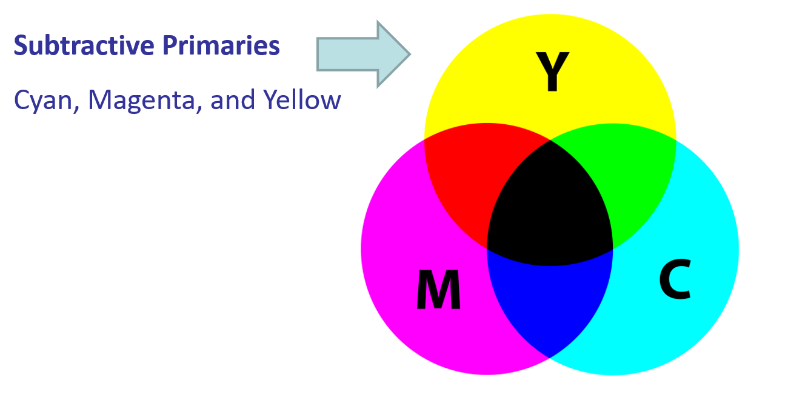
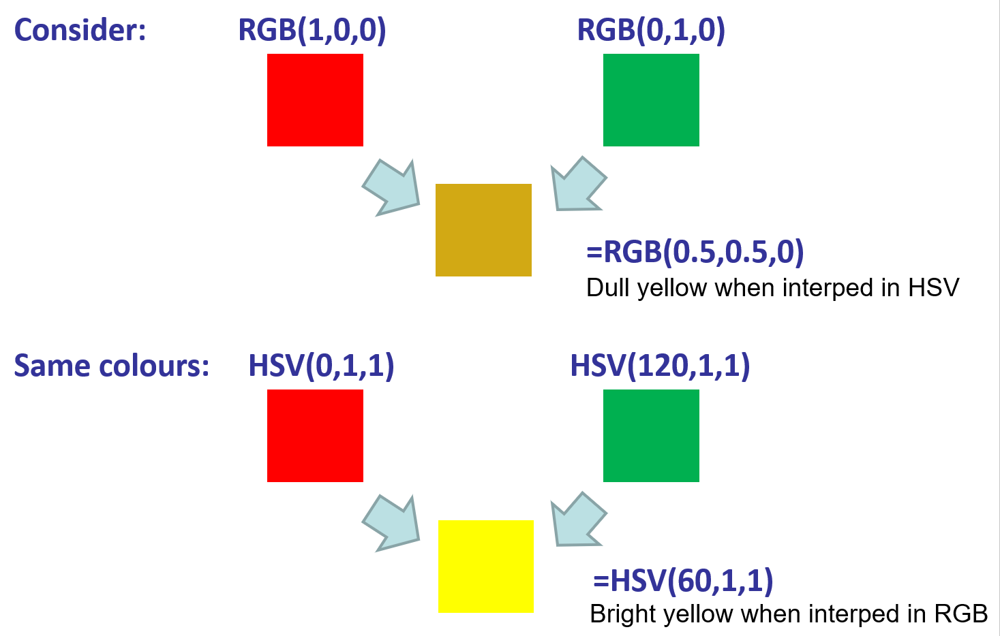

## Color Model
* RGB 
additive colour model
Perceived Luminosity/grey level:  $L =0 .30R+0.59g+0.11b$
* CMY (Cyan, Yellow and Magenta)
the subtractive primaries
used in printing, Using K (Black) saves ink, and adds purity to colour
(0.2, 0.5, 0.6) in CMY   =   (0, 0.3, 0.4, 0.2) in CMYK

* CIE (Commission Internationale de L’Eclairage)/CIEXYZ
Additive model

Usually we pick the max of X, Y, Z as the non-normalised primary to represent brightness of colour (luminance). Encode the other two as normalised
    * Y (Luminance): 1 channel for luminance
    * X,Z (Chromaticity): 2 channels for chromaticity
This is often referred to as the “Tri-stimulus Space”.
A perceptually corrected version of this is the CIELab space.

CIE horseshoe

* HSV
HSV is a more intuitive 3-channel colour model commonly used in UIs;
HSL (Hue-Sat-Luminance) is an alternative, similar model
    * Hue (H): A single channel representation of chromaticity/wavelength
    * Saturation(S): How ‘washed out’ or not a colour appears
        * Unsaturated = Very washed out / White
	    * Saturated = Vibrant colour / Monochromatic
    * Value (V): Approximates Luminance (Brightness of colour)

HSV – Skin Tone

## Interpolating Colour
