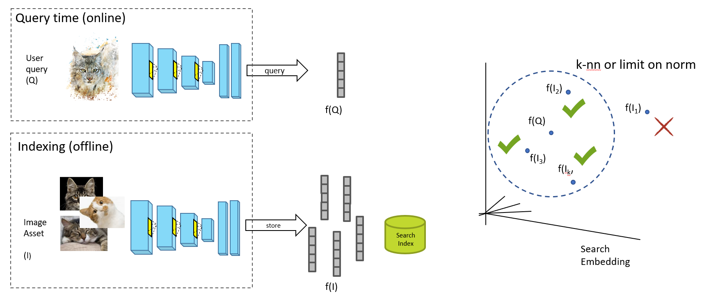
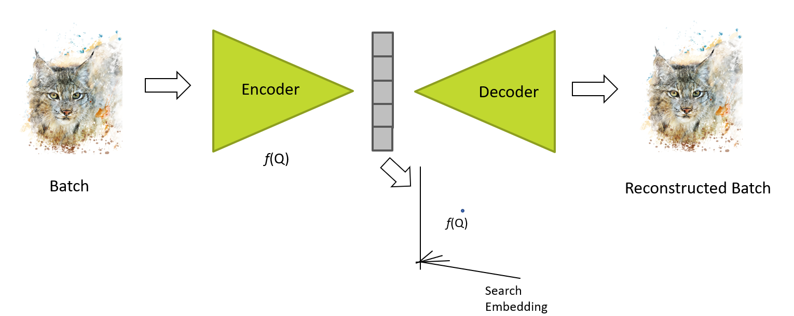

Deep Learning for Image Retrieval
## Deep Visual Search
Images encoded to metric search embedding via fc layer of CNN trained for classification
Embedding means converting data to a feature representation where certain properties can be represented by notions of distance. 
* Images encoded to metric search embedding via fc layer of CNN trained for classification

* Unsupervised learning 
Latent space from autoencoder trained on representative corpus

## Loss
Challenging to maximise AP explicitly in loss due to indication function rel (non-diff)
* rel(n) = 1 if result n is relevant, else 0

surrogate loss function代理损失函数或者称为替代损失函数，一般是指当目标函数非凸、不连续时，数学性质不好，优化起来比较复杂，这时候需要使用其他的性能较好的函数进行替换。
* Pointwise loss (e.g. regression)
* Pairwise loss (e.g. contrastive, triplet, quadruplet!)
* Listwise loss
### Contrastive Loss

### Triplet Loss
Triplet Loss的目标是使得相同标签的特征在空间位置上尽量靠近，同时不同标签的特征在空间位置上尽量远离，同时为了不让样本的特征聚合到一个非常小的空间中要求对于同一类的两个正例和一个负例，负例应该比正例的距离至少远margin

### Listwise (AP) Loss

### Applications
* Triplet Embedding for Style Search

* Triplet Embedding for Cross-Modal Search
    * Partially shared weights between anchor (sketch) and +/- (photo)
    * Two encoding functions learned:
        * Sketch domain -> search embedding
        * Image domain -> search embedding
    * More complicated curriculum learning
    
* Learn joint embedding for structure and style

* Semantic Visual Search

