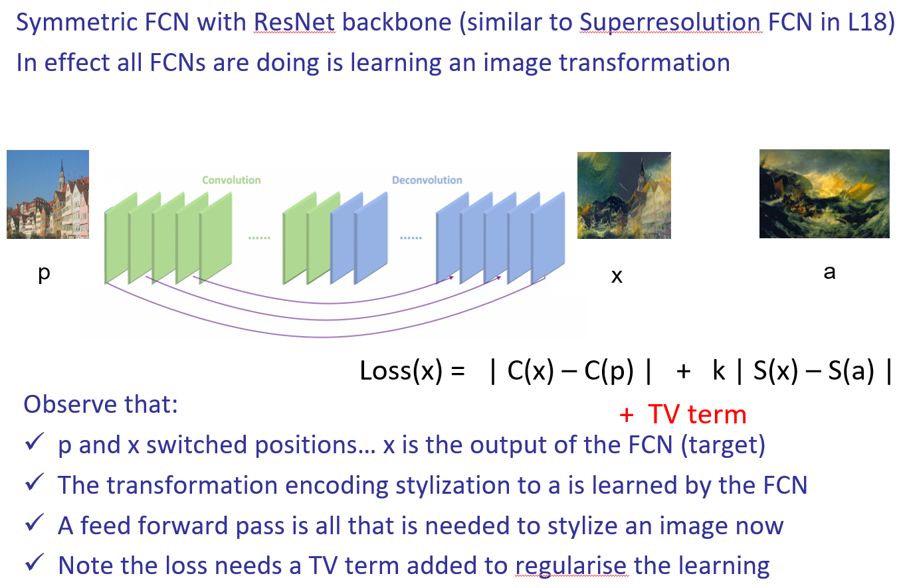
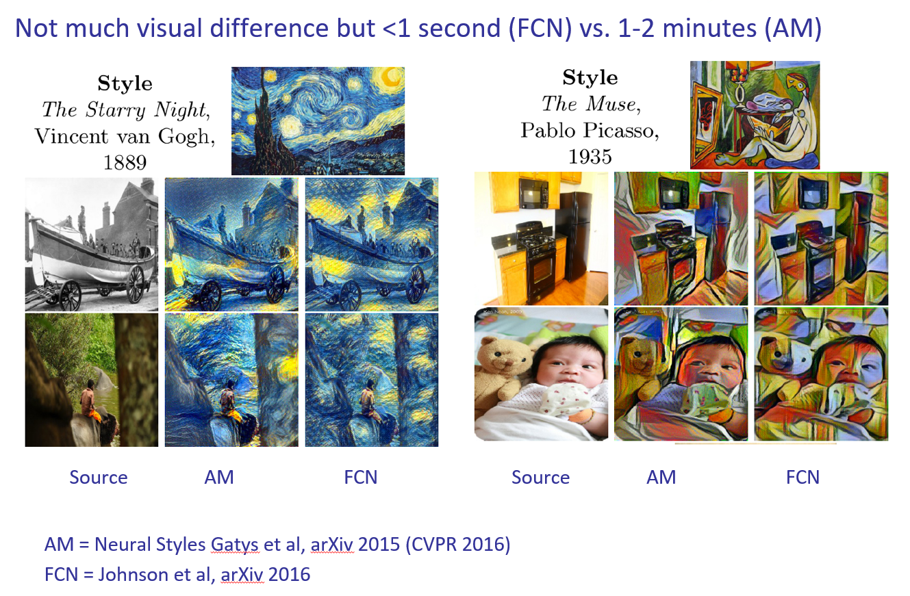

Non-photorealistic Rendering/ NPR
## Classic method: using heuristics 
Paint by Numbers

## Deep Method: Neural Styles
Key observation is that content and style can be decoupled by examining activation responses at different layers of the network
* Content  from a late convolutional layer
* Style  from a Gram matrix across early-mid convolutional layers

This disentangling of structure and style is used in many other works e.g. content term is a ‘perceptual loss’
* Content
A CNN trained on general imagery learns appearance-invariant representation of content in late conv layers

* Style
Edge responses and local textures are responsible for many of the cues we perceive when discriminating between visual styles.

* Descriptors for Content and Style
The Gram matrix is a style descriptor for the image
格拉姆矩阵可以看做feature之间的偏心协方差矩阵（即没有减去均值的协方差矩阵）。格拉姆矩阵用于度量各个维度自己的特性以及各个维度之间的关系。向量点乘可以看作衡量两个向量的相似程度。内积之后得到的多尺度矩阵中，对角线元素提供了不同特征图各自的信息，其余元素提供了不同特征图之间的相关信息。这样一个矩阵，既能体现出有哪些特征，又能体现出不同特征间的紧密程度。

* Loss Function
Given a source image p and an exemplar style image a
Can adjust the style vs content balance by varying k

* Activation Maximisation 
输入层注入噪声，其实可以看作是数据集增强的一种手段，本质是一种正则化。原因是神经网络对于噪声并不健壮，只好混入噪声再进行训练，提高鲁棒性。

Colour appears in S(.) but not so much C(.), so this is also an effective method for colorising images (colour transfer).
* Issues
Does not work well for high frequency styles e.g. graphite / pen sketches
Very slow – couple of minutes on GPU to achieve 2000 iterations
Speed can be improved to real-time using a FCN (3 orders of magnitude faster)
## Encoder-Decoder Nets for Stylization

Perceptual Loss
* Feature Reconstruction Loss
Style Reconstruction Loss
Pixel Loss
Total Variation Regularization
