Generative Adversarial Networks

GANs comprises two stage:
* Generator G synthesises ‘fake’ images x from noise G(z)=x
* Discriminator D is a classifier – is image fake or real?  D(x)=[0,1]
* The two compete during training – resulting in better G and D

## DC-GAN
DCGAN提出使用CNN结构来稳定GAN的训练，并使用了以下一些trick：
* Batch Normalization
* 使用Transpose convlution进行上采样
* 使用Leaky ReLu作为激活函数
### Discriminator
Discriminator is a contractive CNN trained with cross-entropy loss
* Consists only of Conv and leaky ReLu layers.
* Final conv layer is flattened to produce output vector (fake, real)
* Output is normalised via a sigmoid function

### Generator
Generator is a FCN that upsamples from a vector ‘code’ to an image	
* Code is usually very low-D e.g. 100-D
* Code is reshaped to a tensor and up-conved (with Relu) to image
* To train, use Gaussian random noise for code

### Training
#### Step 1: Discriminator 
1. Fix generator weights and feed forward (FF) to generate several fake images
2. Also sample an equal number of real images from a database
3. Train the discriminator via backprop (BP) as with any other  classification CNN, maximize log D(x) + log(1 – D(G(z)))
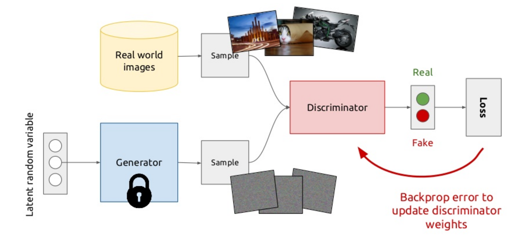
#### Step 2: Generator update
1. Fix discriminator weights and BP to update generator 
2. i.e. sample an image from generator, FF and compute loss against one-hot fake, minimize log(1 – D(G(z))) the generator learns to generate samples that have a low probability of being fake
3. BP the loss through discriminator to update generator weights
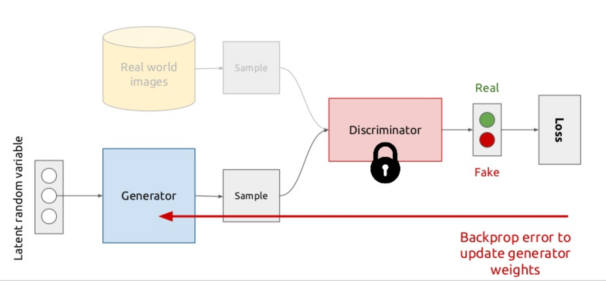
#### Loss
In both steps the loss post-discriminator is a cross-entropy loss
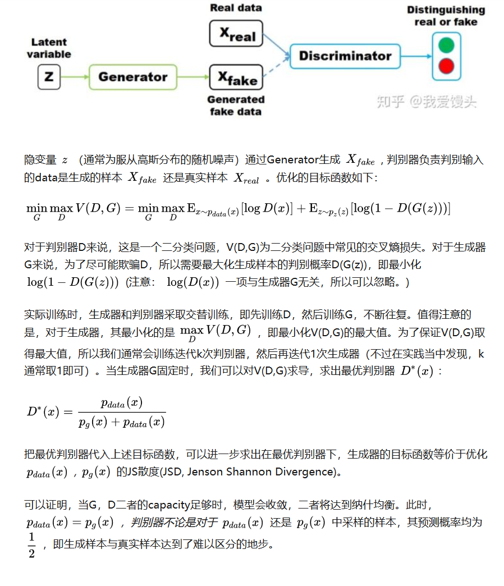
## Mode Collapse
*  the generator fools the discriminator by outputting generated data that looks exactly the same across one batch
* no mechanism to tell the outputs of the generator to become more dissimilar to each other
* all outputs race toward a single point that the discriminator currently believes is highly realistic
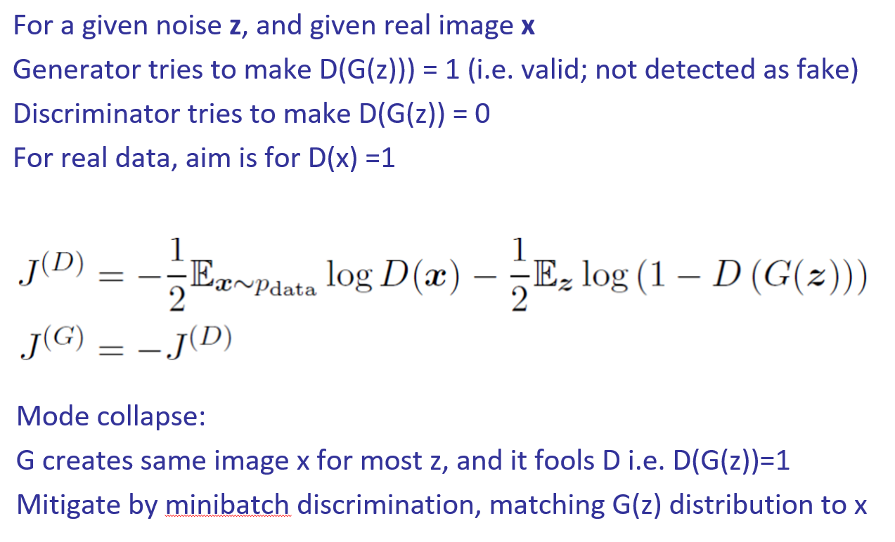

## Conditional GAN
* Specify mode required via conditioning vector
* Conditioning vector doesn’t have to be a label can be any vector, even an image.  
* Noise enables many variants of that mode to be synthesised.
* Code can be minimal or absent if no variation needed.
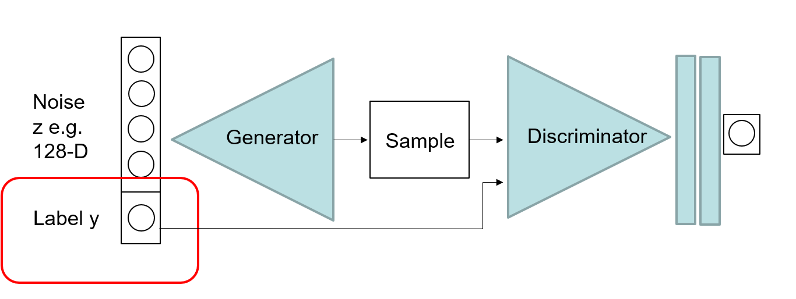
### Text to Image
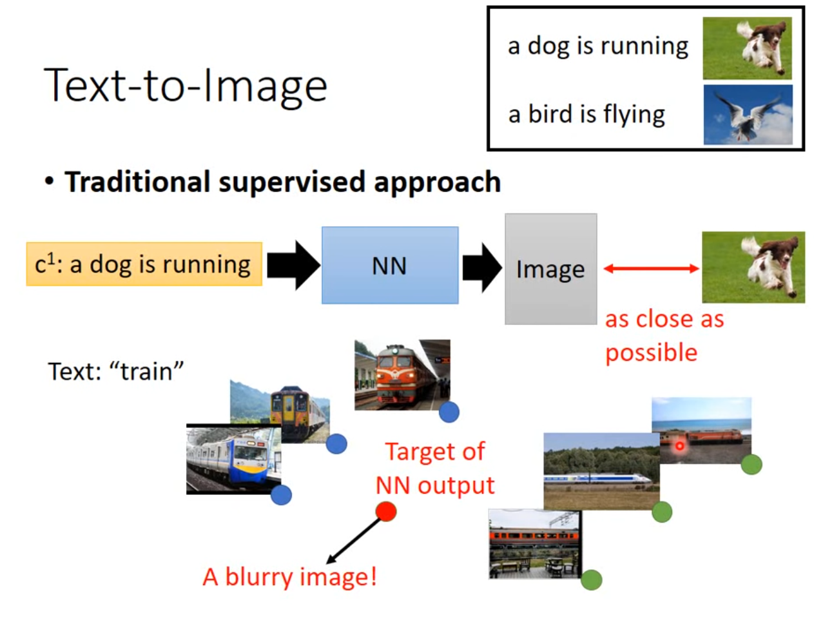
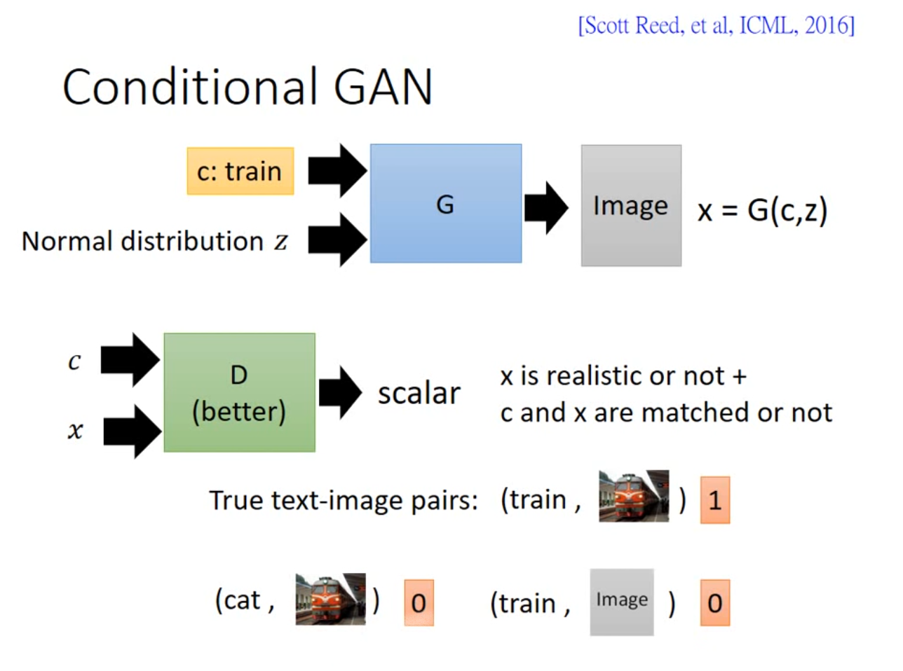
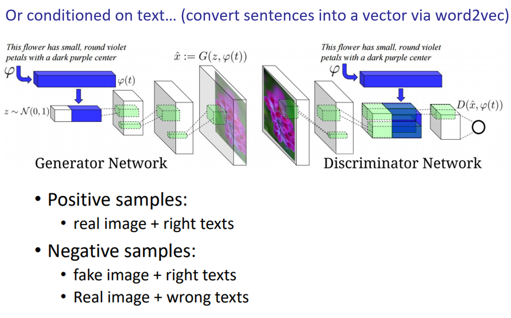
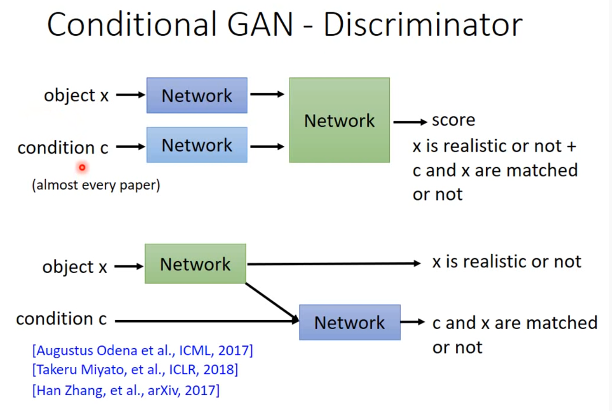

### Image to Image
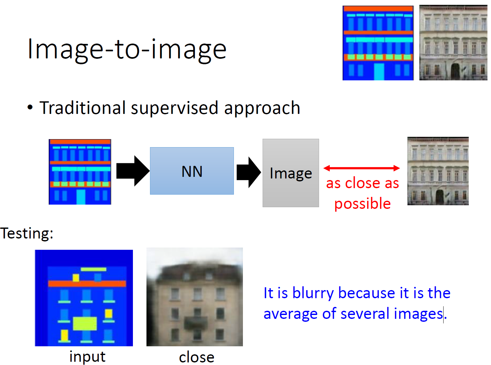
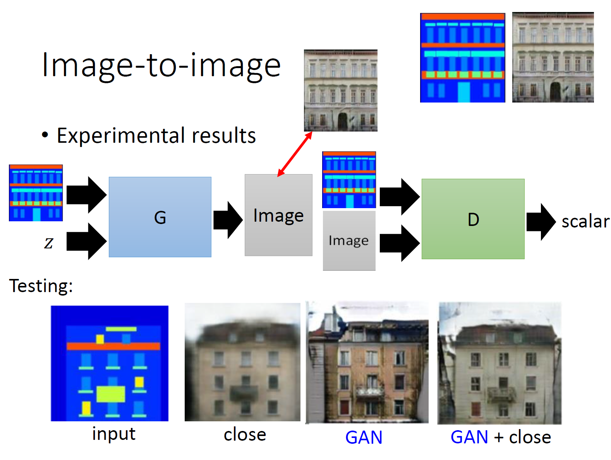

### Stack GAN
One issue with GANs is the synthesised images are blurry/low-res
GAN中的生成器一般是从某个低维（比如100维）的随机分布中采样出一个编码向量，再经过一个神经网络生成出一个高维样本（比如64x64的图片就有4096维）。当生成器的参数固定时，生成样本的概率分布虽然是定义在4096维的空间上，但它本身所有可能产生的变化已经被那个100维的随机分布限定了，其本质维度就是100，再考虑到神经网络带来的映射降维，最终可能比100还小，所以生成样本分布的支撑集就在4096维空间中构成一个最多100维的低维流形，“撑不满”整个高维空间。

The StackGAN first outputs an image of resolution 64² and then takes this as prior information to generate an image of resolution 256².

### Cycle GAN
Image-to-image translation involves generating a new synthetic version of a given image with a specific modification, such as translating a summer landscape to winter.
* Training a model for image-to-image translation typically requires a large dataset of paired examples.
* The CycleGAN is a technique that involves the automatic training of image-to-image translation models without paired examples. 

GAN 1: Translates photos of summer (collection 1) to winter (collection 2).
GAN 2: Translates photos of winter (collection 2) to summer (collection 1).

Forward Cycle Consistency Loss:
* Input photo of summer (collection 1) to GAN 1
* Output photo of winter from GAN 1
* Input photo of winter from GAN 1 to GAN 2
* Output photo of summer from GAN 2
* Compare photo of summer (collection 1) to photo of summer from GAN 2

Backward Cycle Consistency Loss:
* Input photo of winter (collection 2) to GAN 2
* Output photo of summer from GAN 2
* Input photo of summer from GAN 2 to GAN 1
* Output photo of winter from GAN 1
* Compare photo of winter (collection 2) to photo of winter from GAN 1

Cycle consistency loss compares an input photo to the Cycle GAN to the generated photo and calculates the difference between the two, e.g. using the L1 norm or summed absolute difference in pixel values.

http://speech.ee.ntu.edu.tw/~tlkagk/courses_MLDS18.html
https://zhuanlan.zhihu.com/p/58812258
https://towardsdatascience.com/must-read-papers-on-gans-b665bbae3317