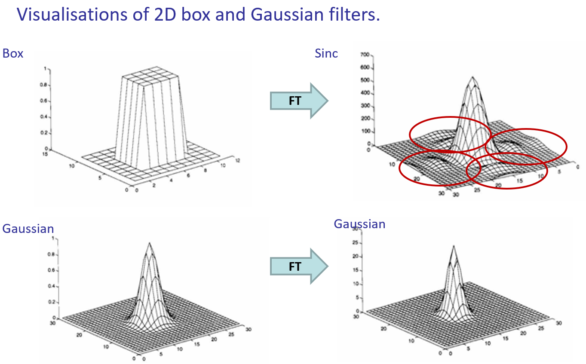

## Discrete Fourier Transform 
2D DFT
$F(u,v)=\frac{1}{MN}\displaystyle\sum_{x=0}^{M-1}\sum_{Y=0}^{N-1}f(x,y)e^{-2\pi i(ux/M+vy/N)}$
2D IDFT
$f(x,y)=\displaystyle\sum_{x=0}^{M-1}\sum_{Y=0}^{N-1}F(u,v)e^{2\pi i(ux/M+vy/N)}$

Convolution Theorem

## Linear Filtering
* low-level noise: 
    * light fluctuations, sensor noise, quantization effects, finite precision
    * remove the former under an assumption, the pixel’s neighborhood contains information about its intensity
* scene clutter: 
    * shadows, extraneous objects, etc.
    * remove via image completion

Each pixel was “replaced” by a linear combination of its neighbours.   This is called linear filtering.

## Low-Level Noise
* Salt and Pepper Noise
removed by Median Filter
* Additive noise
Natural sources of additive noise are often well modelled by a Gaussian distribution
We can mean average corresponding pixels together across images.   
In a single image, we can mean average values in the local neighbourhood window of a pixel to get a noise-reduced estimate for that pixel
low pass filter: high frequency information is lost from the signal
* Blur Filter
    * The FT of a box is a sinc scaled according to the size of the box
    * The FT of a Gaussian of s is a Gaussian of $1/\sigma$

### Box filter
Box filter/Mean filter

The “Ideal” low pass filter is $sinc (x) = sin(x)/x$, but sinc is an  oscillating infinite series and thus cannot be represented in digital images, because they have compact support

A truncated sinc signal in spatial filter creates artifacts in the frequency domain and thus ringing artifacts in the image. 

### Gaussian Filter
A Gaussian does not have this problem.  Although it is an infinite series it does not oscillate, and is “well behaved”
$G_{\sigma} = \frac{1}{2\pi\sigma^2}e^{-\frac{x^2+y^2}{2\sigma^2}}$
FT of a Gaussian s is a Gaussian $1/\sigma$. So, $1/\sigma$  determines the bandwidth of the frequencies passed

### Derivative of Gaussian

edge detection using approximations to Gaussian Derivatives

The Gaussian derivative differentiates the image in one direction (i.e. x or y) and smooths in the orthogonal direction

Second Derivative of Gaussian

### Laplacian for Sharpening 
suppresses both high and low frequencies

The Laplacian is a commonly used arrangement of second derivatives.  Simply the sum of 2nd derivatives wrt. x and y.
image sharpening using Laplacian

梯度的散度：因为标量函数的梯度往往是一种“驱动力”（或者叫“趋势”），而针对“驱动力”求散度就可以知道空间中“源”的分布。

