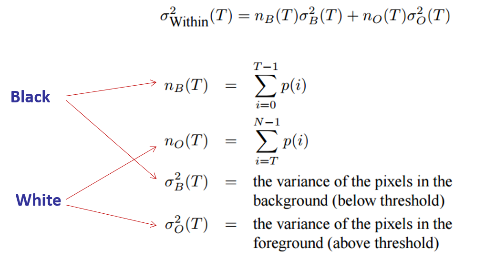
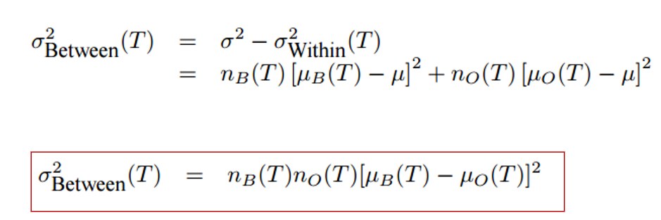
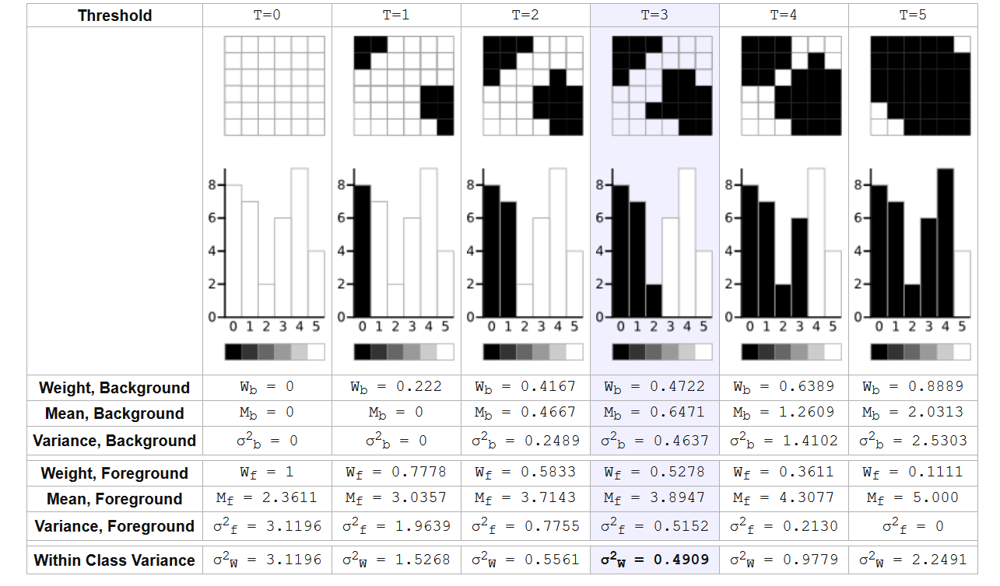

* Negative Image
* Thresholding
    * Optimal global thresholding
    Iterative algorithm for selecting single best threshold (bi-modal)
        * Binary Search for Mean
        * Otsu’s method:  Minimise the spread of the peaks (“within class variance”)
        find T to minimise the within class variance(or to maximize the between class variance, faster)
        
        
        
    * Adaptive thresholding
    Compute the threshold locally within a sliding window 
* Brightness Manipulation
Brightness is the average (mean) luminance of the pixels in an image
add a constant value to the pixel intensities i.e. translate (shift) the histogram
* Contrast Manipulation
Contrast is the difference between the darkest and lightest pixels
Although lost dynamic range cannot be recovered ,we can stretch the histogram to enable clearer perception of intensity differences.
Pixel outliers can cause problems e.g. “Salt and pepper noise”
* Histogram Equalisation
reshapes the histogram (via cumulative pdf) via a transfer function
* Mean-Variance Normalisation
A local correction made within non-overlapping windows (similar to adaptive thresholding windowing) to normalise mean and variance within window