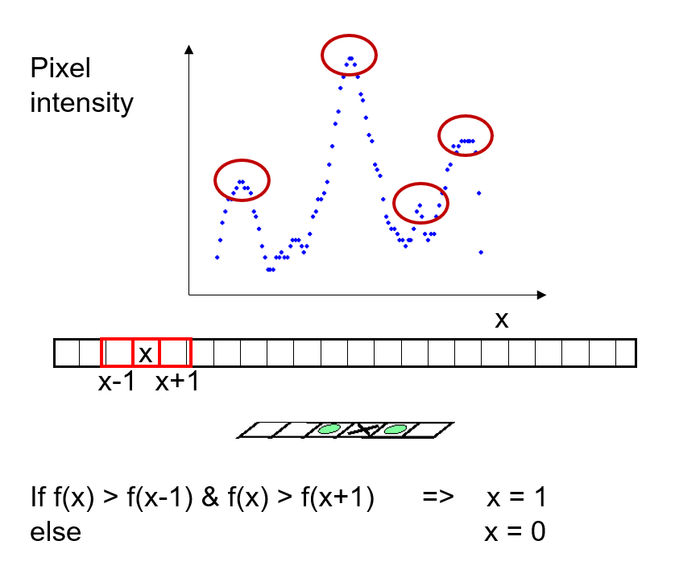
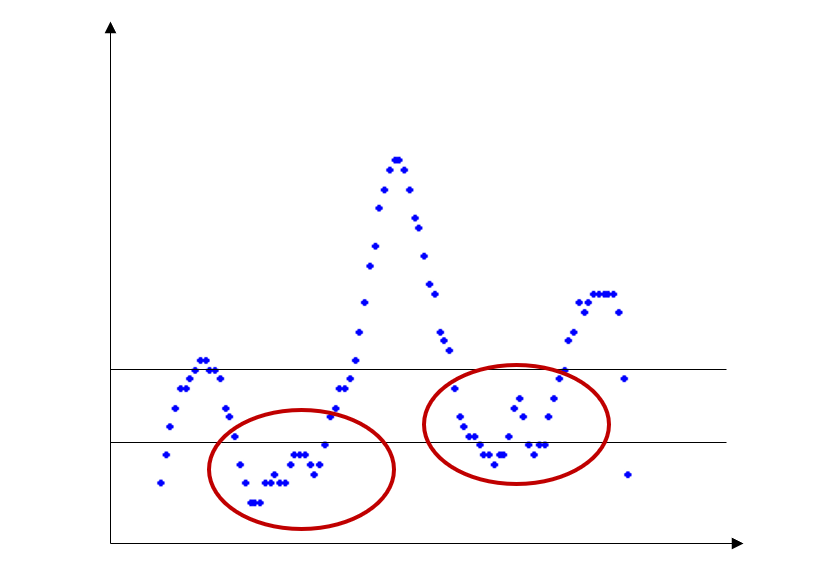
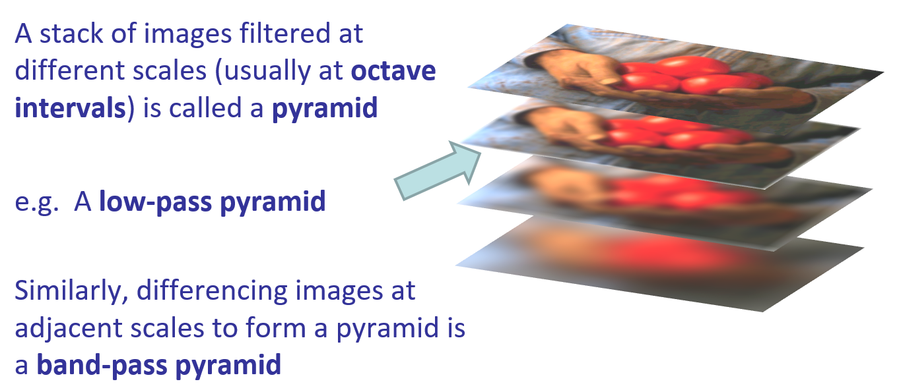
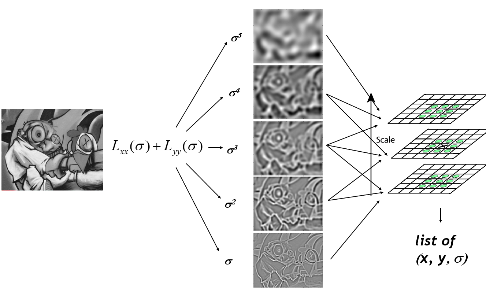

# Edge Detection
An edge is an intensity discontinuity in an image:

ideal: step-edge; finite difference
practical: noisy edge
## Derivative of Gaussian

Convolution is associative

$\frac{d}{dx}(f*h) = f * \frac{d}{dx}(h)$

(differentiation is also kind of convolution)

combine smoothing/differentiation: 
differentiates the image in one direction and smoothes in the orthogonal direction

the first order partial derivative of Gaussian:

Approximations:
* Sobel Operator
Approximation of derivative of Gaussian
$\begin{bmatrix}
1 & 0 & -1\\
2 & 0 & -2\\
1 & 0 & -1
\end{bmatrix} = \begin{bmatrix}
1 \\
2 \\
1 \end{bmatrix}
\begin{bmatrix}
1 & 0 & -1
\end{bmatrix}
$
* Prewitt Operator
$\begin{bmatrix}
1 & 0 & -1\\
1 & 0 & -1\\
1 & 0 & -1
\end{bmatrix} = \begin{bmatrix}
1 \\
1 \\
1 \end{bmatrix}
\begin{bmatrix}
1 & 0 & -1
\end{bmatrix}
$

Sobel filter: smoothing the imagr slightly prior to detecting edges

## Canny Edge Detector
There are 3 major issues:
1. the gradient magnitude at different scales is different; which should we choose? 
    * compare across scales – persistent edges are salient
2. the gradient magnitude is large along a thick trail; how do we identify the significant points?  
    * non-max suppression
3. how do we link edge points up into curves?  
    * hysteresis thresholding

Canny edge detection
1. Filter image with derivative of Gaussian
2. Find magnitude and orientation of gradient
3. Non-maximum suppression
4. Hysteresis thresholding()
    * Select the pixels such over high threshold
    * Collect the pixels above low threshold that are neighbours of already collected edge points

### NMS
performs NMS in direction of max gradient

### Hysteresis Thresholding
Pixels above a global threshold are strongly “edge” (on)
Pixels below a global threshold are strongly “not edge” (off)
Pixels in-between are “edge” only if connected to other “edges”.

### Scale-space
Structural edges e.g. physical boundaries persist across scale
Shadow and noise tend not to.
Retain edges that persist across pairs of scale/threshold values
scale-scale pyramid

Compute a scale-space pyramid using Laplacian of Gaussian (LoG)
Apply NMS across scales to find local maxima over all scales
